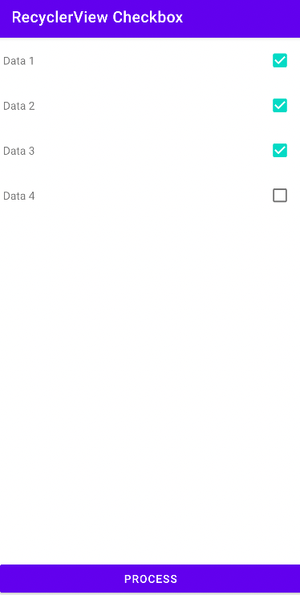

# RecyclerViewCheckbox

<pre>

</pre>

```java
public class MainActivity extends AppCompatActivity {

    private ActivityMainBinding binding;
    private RVCheckBoxAdapter adapter;

    @Override
    protected void onCreate(Bundle savedInstanceState) {
        super.onCreate(savedInstanceState);
        binding = ActivityMainBinding.inflate(getLayoutInflater());
        setContentView(binding.getRoot());

        initRV();
        initOnClick();
    }


    private void initRV() {
        List<String> list = new ArrayList<>();
        list.add("Data 1");
        list.add("Data 2");
        list.add("Data 3");
        list.add("Data 4");

        adapter = new RVCheckBoxAdapter();
        adapter.setList(list);

        binding.rv.setAdapter(adapter);
        binding.rv.hasFixedSize();
        binding.rv.setLayoutManager(new LinearLayoutManager(getApplicationContext()));
    }

    private void initOnClick() {
        binding.btnProcess.setOnClickListener(view -> {
            processData();
        });
    }

    private void processData() {
        List<String> listSelected = new ArrayList<>();

        for (int i = 0; i < adapter.getHolders().size(); i++) {
            ItemRvBinding bind = adapter.getHolders().get(i);
            if (bind!=null){
                if (bind.cb.isChecked())
                    listSelected.add(bind.tvContent.getText().toString());
            }
        }
        Toast.makeText(getApplicationContext(), listSelected.toString(), Toast.LENGTH_SHORT).show();
    }
}
```

- [BaseCallBackAdapter.java](app/src/main/java/com/gzeinnumer/recyclerviewcheckbox/BaseCallBackAdapter.java)
- [RVCheckBoxAdapter.java](app/src/main/java/com/gzeinnumer/recyclerviewcheckbox/RVCheckBoxAdapter.java)
- [item_rv.xml](app/src/main/res/layout/item_rv.xml)
- [empty_item.xml](app/src/main/res/layout/empty_item.xml)
- [activity_main.xml](app/src/main/res/layout/activity_main.xml)

---

```
Copyright 2022 M. Fadli Zein
```